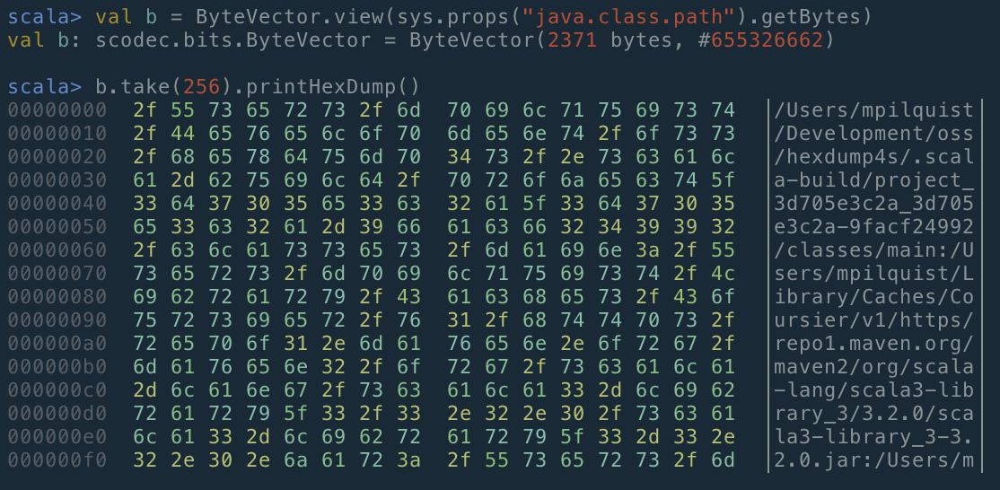
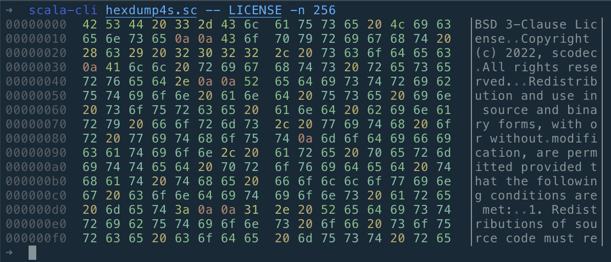
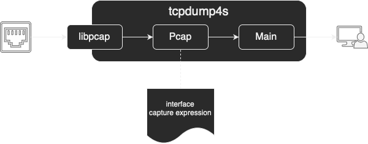
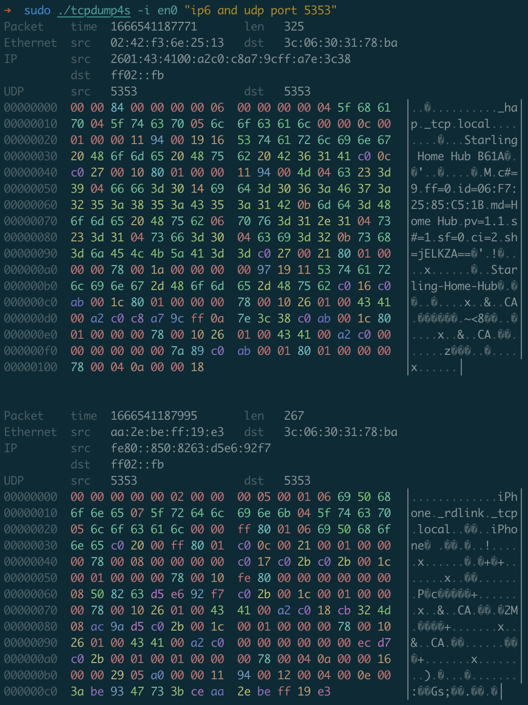

= Cross platform applications with Scala Native
:source-highlighter: highlightjs
:highlightjs-theme: css/solarized-dark.css
:highlightjsdir: highlight
:revealjs_theme: moon
:revealjs_hash: true
:customcss: css/presentation.css
:icons: font

== Hex Dumps

=== Command Line Hex Dumps

[source,scala]
----
//> using scala "3.2.0"
//> using lib "org.scodec::scodec-bits::1.1.34"
//> using lib "com.monovore::decline::2.3.1"
----

=== Command Line Hex Dumps

[source,scala]
----
val command = Command(
  name = "hexdump4s",
  header = "Prints a hex dump of a file"
) {
  val offset = Opts.option[Long](
    "offset", short = "s", metavar = "count",
    help = "Number of bytes to skip at start of input"
  ).withDefault(0L)
  val length = Opts.option[Long](
    "length", short = "n", metavar = "count",
    help = "Number of bytes to dump").orNone
  val noColor = Opts.flag(
    "no-color", help = "Disables color ouptut").orFalse
  val file = Opts.argument[Path](metavar = "file").orNone
  (offset, length, noColor, file).tupled
}
----

=== Command Line Hex Dumps

[source,scala]
----
command.parse(args) match
  case Left(help) =>
    System.err.println(help)
  case Right((offset, limit, noColor, file)) =>
    def data: BitVector =
      val source = BitVector.fromInputStream(
        file.map(f => Files.newInputStream(f))
            .getOrElse(System.in))
      source.drop(offset * 8L)
    HexDumpFormat.Default
      .withAnsi(!noColor)
      .withAddressOffset(offset.toInt)
      .withLengthLimit(limit.getOrElse(Long.MaxValue))
      .print(data)
----

=== Command Line Hex Dumps

[source,shell]
----
➜  scala-cli hexdump4s.sc -- -help
Usage: hexdump4s [--offset <count>] [--length <count>] [--no-color] [<file>]

Prints a hex dump of a file

Options and flags:
    --help
        Display this help text.
    --offset <count>, -s <count>
        Number of bytes to skip at start of input
    --length <count>, -n <count>
        Number of bytes to dump
    --no-color
        Disables color ouptut
----

=== Command Line Hex Dumps

=== Packaging as JVM App

[source,shell]
----
➜  scala-cli package hexdump4s.sc -o hexdump4s -f --assembly

➜  du -h hexdump4s
 17M	hexdump4s
----

=== Packaging as JVM App

[source,shell]
----
➜  time ./hexdump4s LICENSE > /dev/null

________________________________________________________
Executed in  810.57 millis    fish           external
   usr time  925.87 millis    0.24 millis  925.64 millis
   sys time  157.68 millis    6.49 millis  151.19 millis
----

=== Packaging as Native App

Optimizing ahead-of-time compiler via LLVM

[source,shell]
----
➜  scala-cli package --native hexdump4s.sc -o hexdump4s -f

➜  du -h hexdump4s
8.3M	hexdump4s

➜  time ./hexdump4s LICENSE > /dev/null

________________________________________________________
Executed in   61.50 millis    fish           external
   usr time   35.84 millis    0.20 millis   35.63 millis
   sys time   20.09 millis    5.10 millis   14.99 millis
----

=== Packaging as GraalVM Native Image

[source,shell]
----
➜  scala-cli package --native-image hexdump4s.sc -f -- --no-fallback

➜  du -h hexdump4s
 17M	hexdump4s

➜  time ./hexdump4s LICENSE > /dev/null

________________________________________________________
Executed in  156.47 millis    fish           external
   usr time  127.23 millis    0.06 millis  127.17 millis
   sys time   19.13 millis    1.09 millis   18.04 millis
----

== Scala Native

- Ahead of time compiler for Scala
- Supports structs, stack & heap allocation, and pointers
- Painless interop with native code
- No multithreading (yet?)
- Supports Scala 2.11, 2.12, 2.13, and 3

[%notitle]
== tcpdump4s

=== tcpdump4s: Command Line Interface

[source,scala]
----
val command = Command("tcpdump4s", "Network packet captures") {
  val showInterfacesOpt = Opts.flag("interfaces", "shows network interfaces supporting packet capture")
                              .as(showInterfaces)

  val captureOpt =
    val interface = Opts.option[String]("interface", short = "i", help = "name of the interface to capture on")
    val expression = Opts.argument[String](metavar = "expression").orNone
    (interface, expression).mapN(capture)

  showInterfacesOpt orElse captureOpt
}

def showInterfaces: IO[Unit] = ???
def capture(interface: String,
            expression: Option[String]): IO[Unit] = ???
----

=== tcpdump4s main

[source,scala]
----
object Main extends IOApp: <1>
  def run(args: List[String]) =
    command.parse(args) match
      case Left(help) => IO(System.err.println(help))
                           .as(ExitCode(-1))
      case Right(prg) => prg.as(ExitCode.Success)
----
<1> Cats Effect for Scala Native ships with an `IOApp` runtime that uses a single threaded event loop

== showInterfaces

[source,scala]
----
def showInterfaces: IO[Unit] = ???
  // Get all interfaces
  // Filter to only the up & running ones
  // Print the name of the interface and each assigned address
----

=== Pcap.interfaces

[source,scala]
----
/** Provides a high level, functional interface for libpcap. */
object Pcap:
  case class Interface(
    name: String,
    description: String, 
    addresses: List[Address],
    flags: InterfaceFlags)

  def interfaces: IO[List[Interface]] = ???
----

[%notitle]
=== Pcap.interfaces

[source,c]
----
#include <pcap/pcap.h>

char errbuf[PCAP_ERRBUF_SIZE];

int pcap_findalldevs(pcap_if_t **alldevsp, char *errbuf);
void pcap_freealldevs(pcap_if_t *alldevs);
----

[%notitle]
=== Pcap.interfaces

[source,c]
----
typedef struct pcap_if pcap_if_t;

struct pcap_if {
	struct pcap_if *next;
	char *name;		/* name to hand to "pcap_open_live()" */
	char *description;	/* textual description of interface, or NULL */
	struct pcap_addr *addresses;
	bpf_u_int32 flags;	/* PCAP_IF_ interface flags */
};
----

[%step]
[source,scala]
----
/** Exposes libpcap API via Scala Native. */
object libpcap:
  object types:
    // Recursive types disallowed so model next as Ptr[Byte]
    opaque type pcap_if = CStruct5[Ptr[Byte], CString, CString, Ptr[pcap_addr], CUnsignedInt]
    object pcap_if:
      given Tag[pcap_if] = Tag.materializeCStruct5Tag[Ptr[Byte], CString, CString, Ptr[pcap_addr], CUnsignedInt]
      extension (struct: pcap_if)
        def next: Ptr[pcap_if] = struct._1.asInstanceOf[Ptr[pcap_if]]
        def name: CString = struct._2
        def description: CString = struct._3
        def addresses: Ptr[pcap_addr] = struct._4
        def flags: CUnsignedInt = struct._5
----

=== CStructN

* C aligned struct of n elements
* Positional access, not named access (yet)
* opaque type + extension methods pattern
** `Tag` instance allows pointer dereferencing
   (necessary because of opaqueness)
** Can add mutators in addition to accessors

=== findalldevs

[source,c]
----
int pcap_findalldevs(pcap_if_t **alldevsp, char *errbuf);
void pcap_freealldevs(pcap_if_t *alldevs);
----

[source,scala]
----
object libpcap:
  @link("pcap")
  @extern
  object functions:
    import types.*
    def pcap_findalldevs(alldevsp: Ptr[Ptr[pcap_if]],
                         errbuf: CString): CInt = extern
    def pcap_freealldevs(alldevs: Ptr[pcap_if]): Unit = extern
----

=== Pcap.interfaces

[source,scala]
----
object Pcap:
  def interfaces: IO[List[Interface]] = IO {
    zone {                                          <1>
      val p = alloc[Ptr[pcap_if]]()                 <2>
      val errbuf = makeErrorBuffer                  <3>
      val rc = pcap_findalldevs(p, errbuf)
      try
        if rc == 0 then fromPcapIf(!p)
        else throw new RuntimeException(
          "pcap_findalldevs failed with error code " +
            s"$rc: ${fromCString(errbuf)}")
      finally
        pcap_freealldevs(!p)
    }
  }
----
<1> Constructs a new `Zone` and makes it available as a context parameter
<2> Allocates a `Ptr[pcap_if]` in the current zone
<3> Allocates a `CString` in the current zone

=== Zones
 
[.notes]
* Scala Native supports:
** Zone allocation, via `alloc`
** Stack allocation, via `stackalloc`
** Manual heap allocation, via `malloc`
* Memory allocated in a zone is freed when execution leaves the scope
* Idiomatic to take a `Zone` as a context param for temporary memory allocation
* Must be careful to not leak references to zone allocated memory outside its zone

=== Zones

[source,scala]
----
def zone[A](f: Zone ?=> A): A = <1>
  Zone(z => f(using z))

def makeErrorBuffer(using Zone) =
  alloc[CChar](256)
----
<1> Every Scala 3 native project defines this function 😀 

=== Pcap.interfaces

[source,scala]
----
object Pcap:
  def interfaces: IO[List[Interface]] = IO {
    zone { <1>
      val p = alloc[Ptr[pcap_if]]()
      val errbuf = makeErrorBuffer
      val rc = pcap_findalldevs(p, errbuf)
      try
        if rc == 0 then fromPcapIf(!p)                <1>
        else throw new RuntimeException(
          "pcap_findalldevs failed with error code " +
            s"$rc: ${fromCString(errbuf)}")
      finally
        pcap_freealldevs(!p)
    }
  }
----
<1> Converts a `Ptr[pcap_if]` to a `List[Interface]`

=== Pcap.fromPcapIf

[source,scala]
----
private def fromPcapIf(ptr: Ptr[pcap_if]): List[Interface] =
  val bldr = List.newBuilder[Interface]
  var ptrPcapIf = ptr
  while ptrPcapIf ne null do                          <1>
    val entry = !ptrPcapIf
    bldr += Interface(                                <2>
      fromCString(entry.name),
      fromNullableString(entry.description),
      fromPcapAddr(entry.addresses),
      entry.flags)
    ptrPcapIf = entry.next
  bldr.result()
----
<1> Iterate through internal linked list until encountering a null pointer
<2> Copy all necessary data out of the allocated structure and in to Scala objects on GC'ed heap

=== showInterfaces

[source,scala]
----
def showInterfaces: IO[Unit] = ???
  // Get all interfaces
  // Filter to only the up & running ones
  // Print the name of the interface and each assigned address
----

=== showInterfaces

[source,scala]
----
def showInterfaces: IO[Unit] =
  Pcap.interfaces.flatMap { interfaces =>
    interfaces
      .filter(i => i.flags.isUp && i.flags.isRunning)
      .traverse_ { interface =>
        IO.println(interface.name) *>
          interface.addresses.traverse_ { addr =>
            IO.println(s"  ${addr.cidr}")
          }
      }
  }
----

== capture

[source,scala]
----
def capture(interface: String, expression: Option[String]): IO[Unit] =
  // Open stream of packets on target interface
  // Decode & print each packet
----

=== Pcap.livePackets

[source,scala]
----
def livePackets(
  device: String,
  promiscuousMode: Boolean,
  filter: Option[String]
): Resource[IO, (LinkType, Stream[IO, TimeStamped[ByteVector]])] =
  // Open device for live capture
  // Filter captured packets by bpf expression
  // Return the link type of the interface
  // and a stream of packets
----

=== Pcap.openLive

[source,c]
----
pcap_t *pcap_open_live(const char *device, int snaplen,
  int promisc, int to_ms, char *errbuf);
----

[source,scala]
----
object types:
  opaque type pcap = CStruct0
  object pcap:
    given Tag[pcap] = Tag.materializeCStruct0Tag

object functions:
  def pcap_open_live(device: CString, snaplen: CInt,
    promisc: CInt, to_ms: CInt, errbuf: CString
  ): Ptr[pcap] = extern
----

=== Pcap.openLive

[source,scala]
----
def openLive(
  device: String, promiscuousMode: Boolean
): Resource[IO, Pcap] =
  Resource.make(IO {
    zone {
      val errbuf = makeErrorBuffer
      val p = pcap_open_live(toCString(device), 65535,
        if promiscuousMode then 1 else 0, 100,
        errbuf)
      if p eq null then throw new RuntimeException(
        "pcap_open_live failed with error: " +
          fromCString(errbuf))
      else new Pcap(p)
    }
  })(_.close)
----

=== Pcap class

[source,scala]
----
class Pcap private (p: Ptr[pcap]):
  val linkType: Int = pcap_datalink(p)
  def setFilter(s: String): IO[Unit] = ???
  def next: IO[TimeStamped[ByteVector]] = ???
----

=== Pcap.setFilter

[source,scala]
----
class Pcap private (p: Ptr[pcap]):
  def setFilter(s: String): IO[Unit] = IO {
    zone {
      val fp = alloc[bpf_program]()
      var rc = pcap_compile(p, fp, toCString(s), 1, -1.toUInt)
      if rc != 0 then throw new RuntimeException(
        "pcap_compile failed with error code: " + rc)
      rc = pcap_setfilter(p, fp)
      if rc != 0 then throw new RuntimeException(
        "pcap_setfilter failed with error code: " + rc)
    }
  }
----

=== Pcap.next

[source,scala]
----
class Pcap private (p: Ptr[pcap]):
  def next: IO[TimeStamped[ByteVector]] = IO {
    zone {
      val ppHdr = alloc[Ptr[pcap_pkthdr]]()
      val ppData = alloc[Ptr[Byte]]()
      var rc = 0
      while rc == 0 do rc = pcap_next_ex(p, ppHdr, ppData)
      if rc != 1 then throw new RuntimeException(
        "pcap_next_ex failed with error code: " + rc)
      val pHdr = !ppHdr
      val ts = (!pHdr).ts.tv_sec.toInt.seconds +
               (!pHdr).ts.tv_usec.toInt.microseconds
      val size = (!pHdr).caplen.toInt
      TimeStamped(ts, ByteVector.fromPtr(!ppData, size))
    }
  }
----

=== Pcap.livePackets

[source,scala]
----
def livePackets(
  device: String,
  promiscuousMode: Boolean,
  filter: Option[String]
): Resource[IO, (LinkType, Stream[IO, TimeStamped[ByteVector]])] =
  Pcap.openLive(device, promiscuousMode)
    .evalTap(p =>
      filter.map(fltr => p.setFilter(fltr)).getOrElse(IO.unit))
    .map(p =>
      LinkType.fromLong(p.linkType) -> Stream.repeatEval(p.next))
----

=== capture

[source,scala]
----
def capture(interface: String, expression: Option[String]): IO[Unit] =
  Pcap.livePackets(interface, false, expression)
    .use { (linkType, packets) =>
      packets
        .map(_.map(b =>
          DecodedPacket.decode(b, linkType).require))
        .foreach(t =>
          IO.println(t.value.render(t.time)) *> IO.println(""))
        .compile.drain.as(ExitCode.Success)
    }
----

== tcpdump4s

[source,shell]
----
➜  cat build.scala
//> using scala "3.2.0"
//> using platform "scala-native"
//> using repository "sonatype-s01:snapshots"
//> using packaging.output "tcpdump4s"
//> using lib "com.comcast::ip4s-core::3.2.0"
//> using lib "co.fs2::fs2-protocols::3.3.0"
//> using lib "com.armanbilge::decline::2.2.1-SNAPSHOT"

➜  scala-cli package . -f
Wrote /Users/mpilquist/Development/oss/tcpdump4s/tcpdump4s, run it with
  ./tcpdump4s
----

=== tcpdump4s

== Scala Native Challenges

* Build Complexity
* Library Support

=== Scala Native Challenges Answered

* Build Complexity
** scala-cli simplifies experimentation
** sbt-typelevel simplifies SBT builds
** Scala Native supports 2.11, 2.12, 2.13, and 3

=== Scala Native Challenges Answered

* Library Support
** Typelevel ecosystem has embraced Native support
** fs2-io provides cross platform APIs for TCP, TLS, file I/O
** epollcat provides epoll based cats-effect runtime
** http4s, skunk, and more cross compile to native with little/no native specific code

=== Links

*** https://github.com/scodec/hexdump4s
*** https://github.com/mpilquist/tcpdump4s
*** https://github.com/typelevel/fs2
*** https://www.scala-native.org
*** https://typelevel.org/blog/2022/09/19/typelevel-native.html

